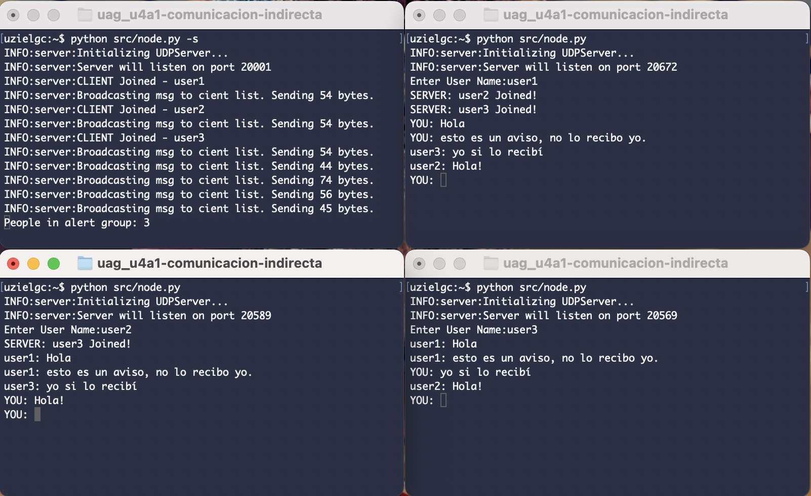
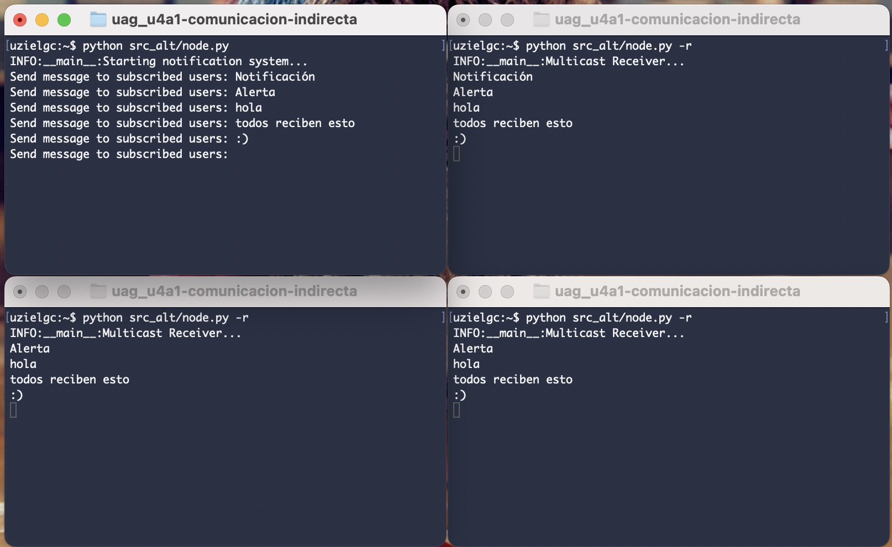

## U4 A1: Práctica de comunicación indirecta.

### Author: Eloy Uziel García Cisneros (eloy.garcia@edu.uag.mx)
#### Repo: https://github.com/uzielgc/uag_u4a1-comunicacion-indirecta

## Documentación

El código fuente se encuentra dentro de la carpeta [src](src), 
se re-utilizó el codigo de la práctica 3 filtrando el envío de mensajes al cliente que los envía. \

Adicionalmente se incluye un códgio adicional que sirve como servicio de notificaciones, en donde un 
servidor manda mensaje a todo cliente registrado escuchando en el grupo seleccionado, estos clientes 
no pueden enviar mensajes, opción 2 se encuentra dentro de la carpeta  [src_alt](src_alt). \

La evidencia en imagenes/video se encuentra en la carpeta [media](media).
El código esta comentado en los puntos clave del proceso.

El código consta de 3 modulos:
    * server.py Contiene la lógica de los servidor. (Recepción de mensajes y filtrado.)
    * client.py Contiene la lógica del cliente. (Envío de mensajes y sobreescribe codigo de servidor.)
    * node.py Ejecutable, inicializa los procesos.

Message broker (main server) y 3 nodos corriendo sumultaneamente.

[](media/u4a1.mp4 "Video Demo")

* Click en la imagen para ir al video demo. (media/u4a1.mp4)^


### Implementación alternativa

[](media/u4a1_ALT.mp4 "Video Demo")

* Click en la imagen para ir al video demo. (media/u4a1.mp4)^

### Validación/Uso

Correr message broker (para distribuir mensajes a todos los clientes, excepto el emisor.):
    `python src/node.py -s`

Correr clientes:
    `python src/node.py`

#### Solución alternativa

Correr message broker:
    `python src_alt/node.py`

Correr clientes:
    `python src_alt/node.py -r`

### Output

Terminal 1 (message broker/server):
```
uzielgc:~$ python src/node.py -s
INFO:server:Initializing UDPServer...
INFO:server:Server will listen on port 20001
INFO:server:CLIENT Joined - user1
INFO:server:Broadcasting msg to cient list. Sending 54 bytes.
INFO:server:CLIENT Joined - user2
INFO:server:Broadcasting msg to cient list. Sending 54 bytes.
INFO:server:CLIENT Joined - user3
INFO:server:Broadcasting msg to cient list. Sending 54 bytes.
INFO:server:Broadcasting msg to cient list. Sending 44 bytes.
INFO:server:Broadcasting msg to cient list. Sending 74 bytes.
INFO:server:Broadcasting msg to cient list. Sending 56 bytes.
INFO:server:Broadcasting msg to cient list. Sending 45 bytes.
INFO:server:Broadcasting msg to cient list. Sending 52 bytes.
INFO:server:Broadcasting msg to cient list. Sending 52 bytes.
INFO:server:Broadcasting msg to cient list. Sending 52 bytes.
```

Terminal 2 (usuario 1, primero en unirse):
```
uzielgc:~$ python src/node.py 
uzielgc:~$ python src/node.py 
INFO:server:Initializing UDPServer...
INFO:server:Server will listen on port 20672
Enter User Name:user1
SERVER: user2 Joined!
SERVER: user3 Joined!
YOU: Hola
YOU: esto es un aviso, no lo recibo yo.
user3: yo si lo recibí
user2: Hola!
SERVER: user2 Left!
SERVER: user3 Left!
YOU: q!
```

Terminal 1 Alternavita (SENDER):
```
uzielgc:~$ python src_alt/node.py 
INFO:__main__:Starting notification system...
Send message to subscribed users: Notificación
Send message to subscribed users: Alerta
Send message to subscribed users: hola
Send message to subscribed users: todos reciben esto
Send message to subscribed users: :)
```

Terminal 2 Alternavita (RECEIVER, same for every receiver):
```
uzielgc:~$ python src_alt/node.py -r
INFO:__main__:Multicast Receiver...
Notificación
Alerta
hola
todos reciben esto
:)
```
